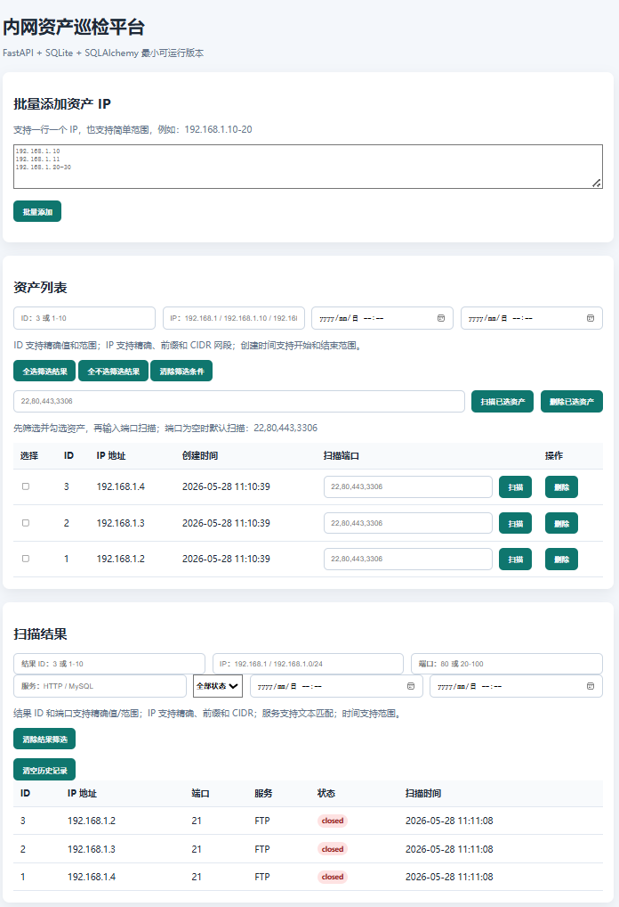

# 基于 Python 的内网资产巡检平台

一个使用 `FastAPI + SQLite + SQLAlchemy + Jinja2` 开发的轻量级内网资产巡检平台。

项目主要用于学习和演示内网资产管理、端口扫描、扫描结果入库、页面筛选和报告前置数据整理等基础能力。当前版本保持代码简单，不引入登录权限、Celery、Redis 或复杂漏洞库，适合初学者阅读和二次开发。

> 本项目仅用于授权范围内的内网资产巡检与安全学习，请勿扫描未授权目标。

## 技术栈

- 后端框架：FastAPI
- 模板引擎：Jinja2
- 数据库：SQLite
- ORM：SQLAlchemy
- 前端：HTML + CSS + 原生 JavaScript
- 扫描方式：Python socket TCP connect
- 并发扫描：ThreadPoolExecutor

## 功能介绍

### 资产管理

- 批量添加资产 IP
- 支持一行一个 IP
- 支持简单 IP 范围，例如 `192.168.1.10-20`
- 自动跳过格式错误的 IP
- 自动跳过数据库中已存在的 IP
- 单个资产无刷新删除
- 勾选资产后批量删除
- 删除资产时同步删除关联扫描结果

### 资产筛选

- 按资产 ID 筛选
- 按 IP 地址筛选
- 按 CIDR 网段筛选，例如 `192.168.1.0/24`
- 按创建时间范围筛选
- 支持全选/全不选筛选后的资产
- 支持清除筛选条件

### 端口扫描

- 支持自定义端口，例如 `22,80,443,3306,8080`
- 端口为空时默认扫描 `22,80,443,3306`
- 端口自动去重
- 校验端口范围，只允许 `1-65535`
- 单个资产扫描和批量扫描共用同一套扫描逻辑
- 使用线程池提升扫描速度
- 前端显示扫描进度条

### 扫描结果

- 扫描结果保存到 SQLite
- 展示 IP、端口、服务、状态、扫描时间
- 内置常见端口与服务名称映射
- 支持清空扫描历史记录

### 扫描结果筛选

- 按结果 ID 筛选
- 按 IP 地址或 CIDR 网段筛选
- 按端口或端口范围筛选
- 按服务名称筛选，不区分大小写
- 按状态筛选：`open` / `closed`
- 按扫描时间范围筛选
- 支持清除结果筛选条件

## 目录结构

```text
.
├── app/
│   ├── core/
│   │   └── config.py
│   ├── db/
│   │   ├── database.py
│   │   └── init_db.py
│   ├── models/
│   │   ├── asset.py
│   │   └── scan.py
│   ├── static/
│   │   ├── css/
│   │   │   └── main.css
│   │   └── js/
│   │       └── main.js
│   ├── templates/
│   │   ├── base.html
│   │   └── index.html
│   └── main.py
├── data/
│   ├── .gitkeep
│   └── app.db
├── docs/
│   ├── database-design.md
│   ├── development-plan.md
│   └── project-structure.md
├── tests/
│   └── __init__.py
├── .env.example
├── .gitignore
├── requirements.txt
└── README.md
```

说明：

- 当前核心逻辑主要集中在 `app/main.py`，方便初学者阅读。
- 数据库模型主要是 `app/models/asset.py` 和 `app/models/scan.py`。
- 页面主要是 `app/templates/index.html`。
- 项目中保留了一些后续扩展目录，当前版本不依赖它们。

## 数据库配置

默认使用 SQLite，数据库文件位置：

```text
data/app.db
```

默认数据库连接配置位于：

```text
app/core/config.py
```

默认连接地址：

```text
sqlite:///./data/app.db
```

核心数据表：

- `assets`：保存资产 IP
- `scan_results`：保存端口扫描结果

启动应用时会自动创建数据表，也可以手动初始化：

```bash
python -m app.db.init_db
```

## 启动步骤

### 1. 克隆项目

```bash
git clone <你的仓库地址>
cd 基于 Python 的内网资产巡检
```

### 2. 创建虚拟环境

Windows：

```bash
python -m venv .venv
.venv\Scripts\activate
```

Linux / macOS：

```bash
python -m venv .venv
source .venv/bin/activate
```

### 3. 安装依赖

```bash
pip install -r requirements.txt
```

### 4. 初始化数据库

```bash
python -m app.db.init_db
```

这一步可以省略，因为应用启动时也会自动创建表。

### 5. 启动项目

```bash
python -m uvicorn app.main:app --reload
```

浏览器访问：

```text
http://127.0.0.1:8000
```

## 扫描参数配置

可以通过环境变量调整扫描线程数和超时时间。

Windows PowerShell：

```powershell
$env:SCAN_WORKERS="120"
$env:SCAN_TIMEOUT_SECONDS="0.5"
python -m uvicorn app.main:app --reload
```

Linux / macOS：

```bash
export SCAN_WORKERS=120
export SCAN_TIMEOUT_SECONDS=0.5
python -m uvicorn app.main:app --reload
```

参数说明：

- `SCAN_WORKERS`：扫描线程数量，默认 `80`
- `SCAN_TIMEOUT_SECONDS`：单个端口连接超时，默认 `0.8`

建议：

- 小规模本地演示可以使用默认值。
- 资产较多时不要盲目调太高，避免对本机和网络造成过大压力。

## 项目截图位置

建议将截图放在：

```text
docs/images/
```

推荐截图文件：

```text
docs/images/dashboard.png
docs/images/assets-filter.png
docs/images/scan-progress.png
docs/images/scan-results.png
```

README 中可按下面方式引用：

```markdown



```

## 后续优化方向

- 增加用户登录和权限控制
- 增加资产名称、部门、负责人、资产类型等字段
- 增加导出 CSV / Excel / PDF 巡检报告
- 增加定时巡检任务
- 增加端口风险等级和安全建议
- 增加漏洞信息管理模块
- 增加扫描任务历史记录
- 支持更多协议识别和 banner 获取
- 支持 PostgreSQL / MySQL 数据库
- 增加 Docker 部署
- 增加前后端分离版本
- 增加单元测试和接口测试

## 免责声明

本项目仅用于安全学习、课程设计、毕业设计或授权范围内的内网资产巡检。使用者应遵守当地法律法规，不得用于未授权扫描、攻击或其他非法用途。
